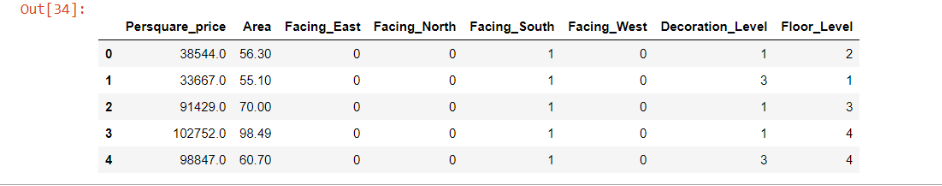

# Haidian Apartment Price Prediction Service

***

## Introduction

In this project, we set up a scalable AI system to provide apartment price (per square meter) service through RESTful API. We collected more than 100,000 apartments price of Haidian, Beijing, in 2020. The dataset's features include area, orientation, floor, and decoration status. The trained model could give an estimating per square meter price according to these factors. Haidian is a popular area of the Beijing real estate market. Hence this system is helpful for the house seeker in Beijing. 

## Architecture

The whole system is all based on AWS cloud and mainly rested on AWS ECS cluster. Amazon Elastic Container Service (Amazon ECS) is a fully managed container orchestration service. The ECS enables use to auto scaler the cluster according to the containers' workload. If the workload is too high, for example, CPU utilization above 80%, the auto scaler would create new workers to share the tasks. On the contrary, the cluster would scale in when the workload downwards. In this system, we choose AWS EC2 as the host of the ECS clusters.

Elastic Load Balancing (ELB) is used as load balance for the system. ELB can automatically distribute incoming application traffic across multiple ECS. We could provide our service on a unique URL instead of a different IP address of each docker container. It can also distribute users' requests to other docker containers to increase the whole system's processing capability with more containers. 

#  YouTube

# Team Member

- Maobin Guo  ( maobin.guo@duke.edu )
- Zhengxin Xie (zhenxing.xie@duke.edu)

